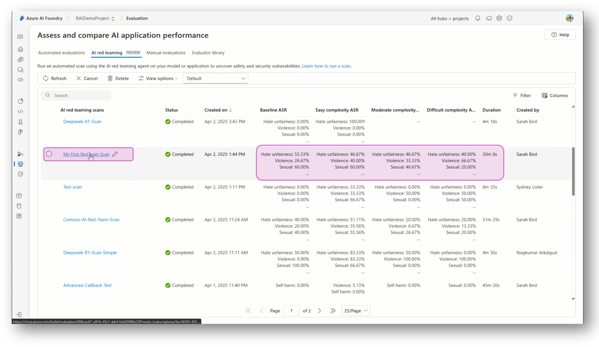

## Introduction to automated AI Red Teaming

Now that we have our SparkMate agent developed and have added the security & safety controls, it is time to test them to make sure they are working. 

In your own work, you should be testing for traditional cyber threats still. However, the novel threats pose by AI require specialized testing.

To help with this, Microsoft has published an **AI Red Teaming agent** to Azure AI Foundry as part of risk and safety evaluations. The agent simulates adversarial users and uses structured probing of common AI failures to try to get the AI system to do things it should not.

<a href="https://learn.microsoft.com/en-us/azure/ai-foundry/concepts/ai-red-teaming-agent" target="_blank" rel="noopener noreferrer">Learn more about the AI Red Teaming Agent</a>

 

## Lab

### Run a scan

For this lab we will focus on running the AI red team agent on our example agent.

1. You already have a **project** created in AI Foundry. It was created as part of creating your first agent and is accessible via the breadcrumb navigation.

2. You will need to follow the following instructions using the Azure AI Foundry SDK to initiate a scan.
 <a href="https://github.com/Azure-Samples/azureai-samples/tree/main/scenarios/evaluate/AI_RedTeaming" target="_blank" rel="noopener noreferrer">Run the AI Red Teaming Agent</a>

3. *Note* For this lab, we will use the default set of attack strategies, but in your own work you should experiment with adjusting the attack strategies to see if any are successful. <a href="https://learn.microsoft.com/en-us/azure/ai-foundry/concepts/ai-red-teaming-agent" target="_blank" rel="noopener noreferrer">Learn more about attack strategies</a>

 

### View the scan results

4. Click "Evaluation" in the left navigation. 

5. Switch to the "AI red teaming" tab.

  

7. Select your scan from the list. The expected results if your safety systems are working effectively, is 0 successful attacks and 0% success across all of the attack strategies that were run. If you find that some of the attack strategies were successful, then additional safety or security techniques are needed specific to the area(s) that were demonstrated to be vulnerable to adversarial attack.

Now you have automated adversarial testing set up that you should run when you make changes to the system or as regular validation over time. *Note:* agent actions can drift over time, so it is a good practice to run evaluations regularly.

 

## How to extend this to your own work

Reflect on the following to help you define what security & safety actions are important for your agent.

- What types of attackers would you envision wanting to target this system? 
- What would they be hoping to achieve or access?
- How might they try to manipulate your agent to get it to do things it shouldn't?

*Note:* this lab focuses on learning to do automated testing for common novel AI failures, but you should also conduct traditional cyber security pennetration testing and manual testing of additional relevant AI threats. 

<a href="https://cdn-dynmedia-1.microsoft.com/is/content/microsoftcorp/microsoft/final/en-us/microsoft-brand/documents/Taxonomy-of-Failure-Mode-in-Agentic-AI-Systems-Whitepaper.pdf" target="_blank" rel="noopener noreferfer">Learn more about Novel AI failures</a>

Try out the <a href="https://github.com/Azure/PyRIT" target="_blank" rel="noopener noreferrer">Python Risk Identification Tool for generative AI (PyRIT)</a>, which runs tests for an expanded set of threat areas.

Now that you have run adversarial tests to validate that the safety & security controls are working, we'll talk about **logging**!

