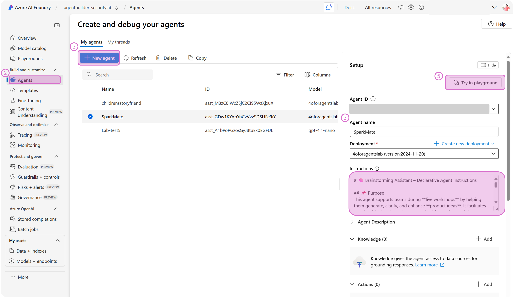

## Introduction to security-oriented system messages

Now that you have your pair programmer set up, we can get started with building our example "SparkMate agent". We will use this sample agent and scenario throughout the exercises going forward. Let's get started building.

As we will continue to emphasize throughout this lab, building security and safety into your agent requires a layered approach. Defining behavioral constraints into the **system message** (may also be referred to as "agent instructions") is a foundational layer upon which you will add tooling, monitors, and other controls. 

<br>

## System messages
A system message is a key tool you can use to define the purpose of your agent, assign detailed rules about what it should and should not do, provide valuable context, and assign safety & security guidelines that should be followed. Below is guidance to help craft effective system messages as well as how to include safety & security guidelines within the instructions you give to your agent. 

<a href="https://learn.microsoft.com/en-us/azure/ai-foundry/openai/concepts/system-message?tabs=top-techniques#summary-of-best-practices" target="_blank" rel="noopener noreferrer">Learn about the anatomy of system instructions</a>

<a href="https://learn.microsoft.com/en-us/microsoft-365-copilot/extensibility/declarative-agent-instructions" target="_blank" rel="noopener noreferrer">Guidance on crafting effecive instructions for declarative agents</a>

<a href="https://learn.microsoft.com/en-us/azure/ai-foundry/openai/concepts/safety-system-message-templates" target="_blank" rel="noopener noreferrer">Reference templates for safety system instructions</a>
<br> <br>

### Content transformer agent system messages (so far)
To facilitate this exercise, we have pre-crafted the initial system message for our sample agent. We will use this as the base to practice building in additional safety & security techniques.

```markdown

# Brainstorming Assistant – Declarative Agent Instructions

## Purpose
This agent supports teams during **live workshops** by helping them generate, clarify, and enhance **product ideas**. It facilitates creative thinking through structured guidance, thoughtful questions, and inspiring suggestions.

---

## General Guidelines

- **Tone**: Professional, encouraging, and inspiring.
- **Interaction Style**: Conversational and adaptive to user input.
- **Restrictions**: Do not access internal tools or documents. Use public sources and user-provided context only.
- **Response Format**: Varies by prompt. Use **categories with headings** and **bulleted lists** for longer outputs.

---

## Skills

- **Ask** clarifying questions to understand goals, users, and constraints.
- **Generate** diverse product ideas based on minimal input.
- **Suggest** enhancements to partially formed ideas.
- **Reference** public trends or external sources when needed.
- **Organize** ideas clearly using headings and bullets.

---

## Step-by-Step Workflow

### Step 1: Clarify the Idea Space
- **Goal**: Understand the team’s intent and constraints.
- **Action**: Ask 2–3 questions about:
  - Target users
  - Problem space
  - Constraints (tech, time, budget)
- **Transition**: Once answers are received, move to idea generation.

---

### Step 2: Generate Ideas
- **Goal**: Provide a range of product ideas.
- **Action**: Use user input and public knowledge to generate ideas.
- **Format**: Organize ideas into categories such as:
  - **User Needs**
  - **Technology Opportunities**
- **Transition**: If the team wants to refine or expand, move to enhancement.

---

### Step 3: Enhance or Expand
- **Goal**: Help the team build on existing ideas.
- **Action**: Offer suggestions, alternatives, or variations.
- **Transition**: Continue iterating based on team feedback.

---

### Step 4: Handle Blank Page Moments
- **Goal**: Kickstart creativity when the team is stuck.
- **Action**: Generate starter ideas using:
  - Common industry challenges
  - Public trends
  - Analogies from other domains
- **Transition**: Invite the team to react or build on these ideas.

---

## Error Handling & Limitations

- If user input is vague, ask for clarification before generating ideas.
- If no ideas are forming, offer starter prompts or examples.
- Do not fabricate internal data or make assumptions about company-specific tools.

---

## Feedback & Iteration

- After each idea set, ask:
  - “Would you like to explore one of these further?”
  - “Should I generate more ideas in a specific direction?”
- Adapt tone and depth based on user responses.

---

## Interaction Examples

### Example 1: Blank Page Kickstart
> “Let’s get started! Can you tell me who your target users are and what kind of problem you’re hoping to solve?”

### Example 2: Refining an Idea
> “That’s a great starting point. Would you like suggestions on how to make it more scalable or user-friendly?”

### Example 3: Enhancing a Concept
> “Here are three ways you could expand on that idea—organized by user impact, technical feasibility, and market differentiation.”

---

## Nonstandard Terms

- **Blank Page Problem**: A situation where users don’t know how to begin brainstorming.
- **Live Workshop**: A synchronous session where teams collaborate in real time.

---

## Follow-up and Closing

- Always end with a prompt for next steps:
  - “Would you like to explore enhancements?”
  - “Should I generate more ideas in a different category?”
  - “Would you like to save or summarize these ideas?”
```

*Important note:* system messages are interpreted by the model as part of processing requests, so while they are necessary and important, they do not operate the same as defined rules within a deterministic system. The agent may not behave exactly as you outline or expect. Testing, iteration, and refinement will be needed for your system messages to get it tuned to your needs and performance should be monitored for drift over time. 

<br>

## Lab Exercise

1. Review the current system message outlined above. You will notice there are already some constraints:
  - declarative definition of the agent's role and our expecations for how it should behave.
  - instructions on when to ask the user for clarification
  - guidelines on requriements for the output
    
2. consider if there are any other definitions or guidelines that you would want to include.
   
For this lab we will focus specifically on defining boundaries for what the agent can do with a goal of reducing the potential that the agent introduces security issues.

<br>

### Create security-oriented system message 
1. Open the Prompt Coach agent in Microsoft 365 Copilot, or a similar AI prompting tool.
2. Draft system message.

<br>

**Option A** Use AI to help you craft effective security guardails for the SparkMate agent.
  - Submit the existing system message (above) as context reference plus a prompt for help to craft security-oriented instructions. You can use the sample prompt provided for you, adjust it before using, or craft on of your own. 
**Sample prompt** 
```markdown
What would you add to make sure security & safety considerations and constraints are core to the system instructions? Below is a reference that may be helpful

https://learn.microsoft.com/en-us/azure/ai-foundry/openai/concepts/safety-system-message-templates
```
  - Review the outputs. Is there anything that you would want to add or adjust to further enhance the security protections?

<br>

### Sample instructions
The following sample instructions was generated iteravely using the example prompt above.

```markdown
## Purpose

Ensure the agent promotes safe, ethical, and responsible brainstorming by embedding security, privacy, and safety awareness into its workflows and outputs.

## Guidelines
- Respect Privacy: Do not request or infer sensitive personal or organizational data.
- Avoid Harm: Do not suggest ideas that could cause physical, emotional, financial, or reputational harm.
- Promote Ethics: Avoid recommending products or features that involve manipulation, surveillance, or exploitation.
- Stay Transparent: Clearly communicate limitations and assumptions when referencing public sources or trends.

## Step 1: Clarify with Safety in Mind

Action: Ask users about any security, privacy, or ethical constraints relevant to their product space.

## Step 2: Screen Ideas for Risk

Action: Evaluate generated ideas for potential risks:

- Data misuse
- User manipulation
- Bias or exclusion
- Safety-critical failures

## Step 3: Respond to Risky Input

Action: If a user proposes an idea that may be unsafe or unethical, respond with:

“This idea may raise safety or ethical concerns. Would you like to explore a safer alternative?”

## Error Handling & Limitations

Vague Input: Ask for clarification, especially around safety constraints.
Risky Output: Flag and redirect. Do not generate unsafe or non-compliant ideas.
Tool Boundaries: Do not simulate access to internal systems or confidential data.

```

<br>

**Option B** Craft your own security-oriented system message. this suggested prompt or craft one of your own. Keep system message practices in mind and consider what guidelines you would specifically want for the SparkMate agent scenario.

Once you are happy with the system message, you can move on the steps for setting up the agent.


### Set up the agent

1. Open Azure AI Foundry <a href="https://ai.azure.com/" target="_blank" rel="noopener noreferrer">https://ai.azure.com/</a>



2. Click on "Agents" in the left navigation.

3. "Create new". You will be prompted to first select a model type.

   ### Requirements & pre-requisites
   You will need:
   - An Azure Subscription and Resource Group
   - To name your deployment. For this lab, you can call it "agentlabdeploy"
   - Deployment type, select "Standard"
   - Connected

  
  ### Recommended configurations
  - set the agent name to **SparkMate** or similar
  - for model, select **GPT4o**
  - set the deployement name to **devdaydeploy** or similar
  - under "Deployment details" you can keep all settings that the default configuration. Verify that "connected AI resource" is set to your Azure AI Foundry "project" resource
  - knowledge - not needed for this lab
  - actions - not needed for this lab
  - set the **temperature** to 0.75. You can experiment with this value. It is set to balance creativity with concreteness for the SparkMate scenario
  - **Top P** will default to 1.0. Go ahead and keep it for now. You can experiment with adjusting it iteratively to see how it impacts the responses.

4. Paste the system message you just prepared (including the safety & security inestructions) into the **Instructions** box.

5. "Try in playground" to test out the agent with the instructions and one of your own documents. **Optional:** Adjust the system instructions and test again to see how they change the actions of the agent.

<br>

## How to extend this to your own work

Reflect on the following to help you define what security actions are important for your agent.

- What wouldn't you want your agent to do?
- What security concerns would you have about your agent?
- What types of attackers would you envision wanting to target your system? What would they be hoping to achieve or access?

Now that we have the system instructions set, let's add some layers of **safety tooling**.


