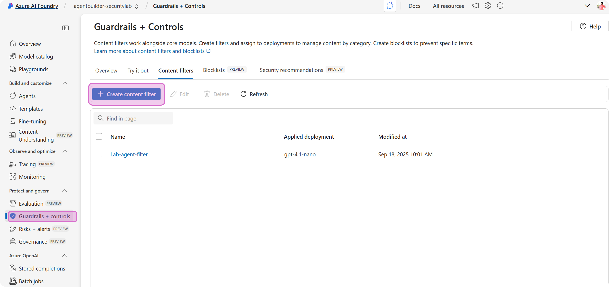
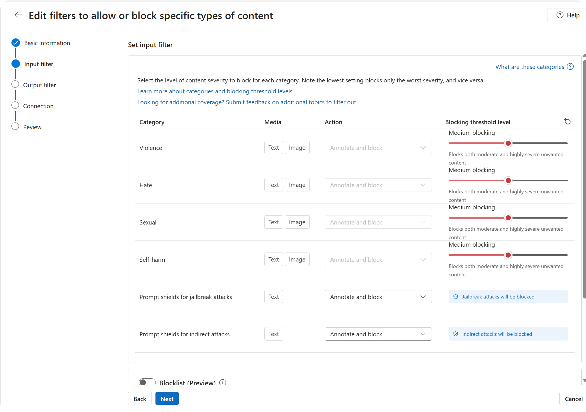
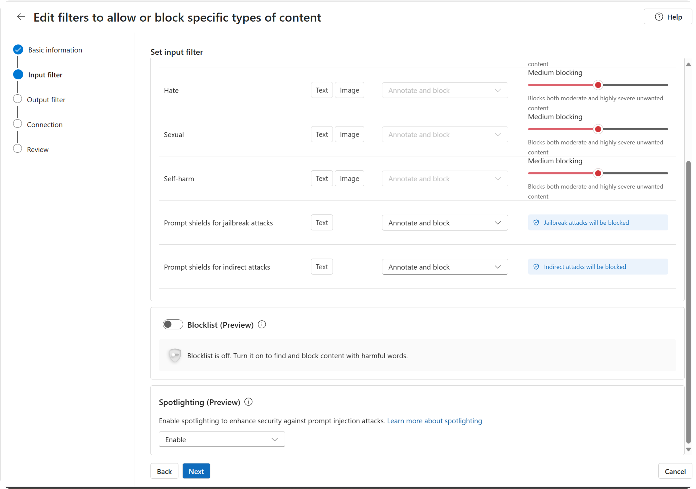
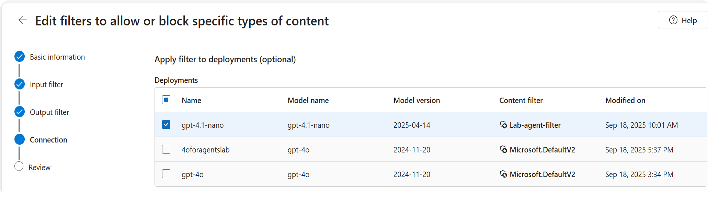

## Introduction safety systems

Now that you have set up the SparkMate agent with constraints applied to the agent's system instructions, we will focus on adding layers of tooling. There are a variety of tools available to help protect against Cross Prompt Injection (XPIA) and other novel AI threats that seek to manipulate your agent into taking inappropriate actions. Each adress a different aspect of the vulnerability and work best when used together.

- **Prompt shield**: analyze user input for potential to be adversarial attacks and block flagged inputs. <a href="https://learn.microsoft.com/en-us/azure/ai-foundry/openai/concepts/content-filter-prompt-shields" target="_blank" rel="noopener noreferrer">Learn more about Prompt Shield</a>
- **Spotlighting**: tags input documents with special formatting so that they model will treat it as less trustworthy than direct user prompts or system instructions. <a href="https://learn.microsoft.com/en-us/azure/ai-foundry/openai/concepts/content-filter-prompt-shields#spotlighting-for-prompt-shields-preview" target="_blank" rel="noopener noreferrer">Learn more about spotlighting</a>
- **Task adherence**: evaluates how well an AI-generated response follows the assigned tasks based upon alignment with instructions & definitions, accuracy & clarity of the response, and proper use of provided tool definitions. <a href="https://learn.microsoft.com/en-us/azure/ai-foundry/concepts/evaluation-evaluators/agent-evaluators#task-adherence-output" target="_blank" rel="noopener noreferrer">Learn more about task adherence</a>

 

## Lab

For this lab we will focus on configuring filters to detect injection attack attempts on the inputs and block safety issues in the outputs.

### Create content filter

1. You should already have your initial agent configured in Azure AI Foundry (Lab 2).
2.  Click "Guardrails + controls" in the left navigation. 
3. "Create content filter". You'll need to give it a name (for example "lab-agent-filter").

 

### Configure content filter: inputs

4. Configure input filter

  - *Optional* You can adjust the "blocking threshold level" if you want to experiment with how it works. This determines the sensitivity for each category. The higher the blocking you select, the more sensitive it will be to input content that it labels as potentially harmful. *Note:* these are probabalistic classifiers, so they assign a score of the likelihood that content contains objectionable content. Higher sensitivity means that it will flag content that has a lower likelihood score.
  - Make sure the "prompt shields for jailbreak attacks" is set to **annotate and block**. This will flag prompts that it detects as potentially including direct prompt injection from the user, terminate processing, and notify the user that it cannot proceed.
  - Set the "prompt shields for indirect attacks" to **annotate and block**. This will flag inputs that it detects as potentially including indirect prompt injection (XPIA), terminate processing of that prompt, and notify the user that it cannot proceed.
  - We will not focus on "blockist" for this lab, but you may want to experiment with it for your own scenarios in the future.  
  - Set "spotlighting" to **enable**.

 

### Configure content filters: outputs
5. Configure output filter
  - *Optional* You can adjust the "blocking threshold level" if you want to experiment with how it works. It works the same as described above, except in this case it is analyzing the model output for harmful content being included in the response.
  - Turn "protected material for text" to *on*. This will analyze the output for material text describes known protected text content (for example, song lyrics, articles, recipes, and selected web content). It is useful for this scenario because the SparkMate agent may be composing new text blocks as part of its work.
  - *Optional* The "protected material for code" does not need to be on for this scenario since our agent is not generating code, but you can set it to **annotate only** to experiment.
  - "Streaming mode" should be set to **default**.

6. Connect the filter to your **model deployment**. You will have created a model deployment during Lab 2 as part of creating your agent.

7. Complete filter creation.

8. You should test the filters under the "Try it now" tab or within the "playground" UI for your agent. 

You will also test your safety system in more depth in a future step of this lab. You have just completed setting up prompt shields and spotlighting, now you're ready to configure the task adherence evaluation.

 

### Configure task adherence

9. Task adherence setup is not yet integrated within Azure AI Foundary UI, but you can configure and run it using these <a href="https://github.com/Azure-Samples/azureai-samples/blob/main/scenarios/evaluate/Supported_Evaluation_Metrics/Agent_Evaluation/AI_Judge_Evaluator_Task_Adherence.ipynb" target="_blank" rel="noopener noreferrer">set-up instructions</a>.
10. Once you run it, you can see the results in the "Evaluations" UI in Foundry.

 

## How to extend this to your own work

Reflect on the following to help you define which security & safety actions are important for your agent.

- How likely is your agent scenario to ingest and output objectionable content? Is handling of this type of information core to your business scenario?
- How do you want user prompt injections to be handled when they are detected?
- How do you want indirect prompt injections to be handled when they are detected? 

Now that you have implemented your security & safety configurations for your agent, it's time for **adversarial testing**!

