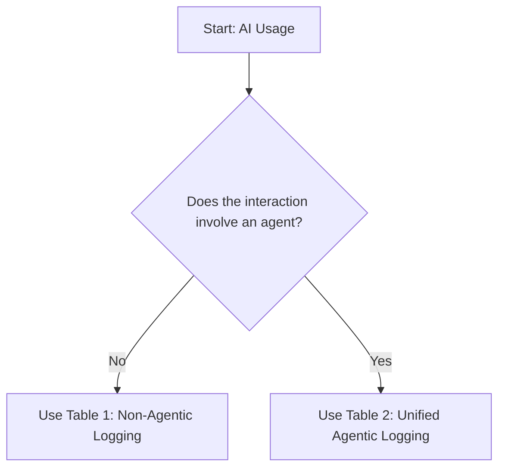
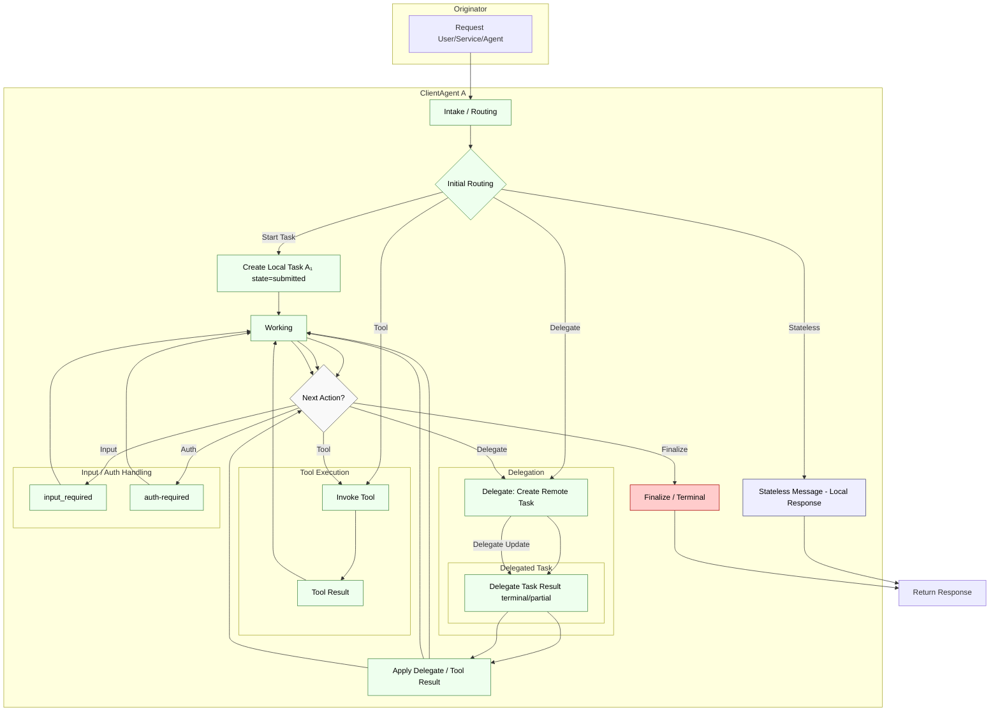
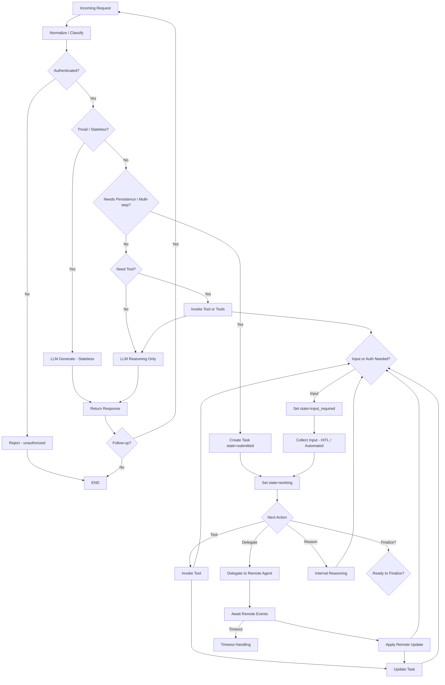

## Introduction

We will not do this step as part of this lab, but before we deploy the Content Transfomer agent for use in production, logging needs to be implemented to ensure that we have the records of actions taken by the agent and user interactions with the agent. This is a key element of security & compliance for any system because it provides an auditable record that can either demonstrate adherence or help with an invesetigation if something goes wrong.

Microsoft Purview offers <a href="https://learn.microsoft.com/en-us/purview/audit-copilot" target="_blank" rel="noopener noreferrer">audit logging for AI and Copilot</a> or you can implement your own audit logging approach.

## Lab

### Observability: reference schema

For this lab, the focus is on providing you a reference schema with guidance for implementing for your own solution. *Use the decision tree below to determine which table is most relevant to your scenario*

1. Review the schema options and determine what would be appicable to the Content Transformer agent.

## Logging Table Decision Guide

---

## Table 1 — Reference example user activities with Copilot and AI applications 
Here is a <a href="https://learn.microsoft.com/en-us/purview/audit-copilot#user-activities-with-copilot-and-ai-applications" target="_blank" rel="noopener noreferrer">reference example</a> of minimum logging schema for AI applications.
                 

## Table 2 — Full Snapshot Profile (Complete Superset)

| # | Field | Type | Description | Mapping (Source) | OTel Mapping |
|---|-------|------|-------------|------------------|--------------|
| F2 | SpanType | string | ExecutionSpan|InvocationSpan|ToolSpan|InferenceSpan | activity name | gen_ai.operation.name (invoke_agent|create_agent|execute_tool|generate_content/chat) + span.kind=CLIENT/SERVER |
| F3 | Role | string | Actor role (Human/Agent/Event/System) | sourceMetadata.role | gen_ai.agent.role (proposed) |
| F4 | Perspective | string | Caller or Callee | derived / explicit | gen_ai.agent.perspective (proposed) |
| F5 | ExecutionType | string | HumanToAgent|Agent2Agent|EventToAgent|Unknown | executionType tag | gen_ai.agent.execution.type (proposed) |
| F6 | AgentID | string | Executing agent id (self) | gen_ai.agent.id | gen_ai.agent.id |
| F7 | AgentName | string | Human-friendly name | gen_ai.agent.name | gen_ai.agent.name |
| F8 | AgentDescription | string | Agent description | gen_ai.agent.description | gen_ai.agent.description |
| F9 | SessionID | string | Stable conversational/session id | session.id | session.id |
| F10 | ConversationID | string | High-level conversation/thread id | gen_ai.conversation.id | gen_ai.conversation.id |
| F11 | TargetAgentID | string | Remote agent when delegating (Caller) | remote agent id | gen_ai.target.agent.id (proposed) |
| F12 | TargetAgentEndpointHost | string | Remote host (Caller) | server.address | server.address |
| F13 | TargetAgentEndpointPort | int | Remote port (Caller) | server.port | server.port |
| F14 | RequestContent | string | Input prompt/content | gen_ai.request.content | gen_ai.request.content |
| F15 | ResponseContent | string | Final response text | gen_ai.event.content | gen_ai.event.content |
| F20 | StartTime | datetime | Operation start ts | activity start | span.start_time |
| F21 | EndTime | datetime | Operation end ts | activity end | span.end_time |
| F22 | SnapshotID | string | Unique snapshot record id | gen_ai.snapshot.id | gen_ai.snapshot.id (proposed) |
| F23 | SnapshotSequence | string | Ordered sequence / DAG reference | gen_ai.snapshot.sequence | gen_ai.snapshot.sequence (proposed) |
| F24 | TaskStatus | string | Task/message status (completed, failed, working, etc.) | gen_ai.agent.task_status | gen_ai.agent.task_status (proposed) |
| F25 | BlockingType | string | input-required|auth-required|rate-limit | gen_ai.blocking.type | gen_ai.blocking.type (proposed) |
| F26 | ArtifactID | string | Individual artifact id | gen_ai.artifact.id | gen_ai.artifact.id (proposed) |
| F27 | ArtifactCount | int | Total artifacts produced | gen_ai.artifact.count | gen_ai.artifact.count (proposed) |
| F28 | AccessedArtifacts | array/json | List of accessed artifact storage location/urls | gen_ai.artifact.accessed | gen_ai.artifact.accessed (proposed) |
| F28 | InputArtifacts | array/json | List of user provided artifact storage location/urls | gen_ai.artifact.accessed | gen_ai.artifact.accessed (proposed) |
| F29 | GeneratedArtifacts | array/json | List of generated artifact storage location/urls | gen_ai.artifact.generated | gen_ai.artifact.generated (proposed) |
| F41 | ExecutionPhase | string | planning|invocation|finalizing | gen_ai.phase | gen_ai.phase (proposed) |
| F42 | AgentVersion | string | Agent implementation version | gen_ai.agent.version | gen_ai.agent.version (proposed) |
| F43 | TargetAgentVersion | string | Remote agent version | gen_ai.remote.agent.version | gen_ai.target.agent.version (proposed) |
| F44 | AgentGoLiveDate | date | Agent production go-live date | gen_ai.agent.go_live_date | gen_ai.agent.go_live_date (proposed) |
| F45 | TargetAgentGoLiveDate | date | Remote agent go-live date | gen_ai.remote.agent.go_live_date | gen_ai.target.agent.go_live_date (proposed) |
| F46 | TargetAgentOwnership | string | Ownership classification (1P|3P) | (new provenance source) | gen_ai.target.agent.ownership (proposed) |
| F47 | TargetAgentPublisher | string | Publisher / vendor identifier (org slug) | (new provenance source) | gen_ai.target.agent.publisher (proposed) |
| F48 | InferenceSpan Fields (from Table 1)* | object | Model invocation details | inference span fields | (see inference span attributes) |
| F49 | ToolSpan Fields (from table 2.1)* | object | MAY | Tool execution details | see Tool table | Tool calls separate spans |
| F50 | InputModalities | array/string | Modalities present in request (text,image,audio,video,document,structured) | derived request parts | gen_ai.input.modalities (proposed) |
| F51 | OutputModalities | array/string | Modalities produced in final/partial response | derived artifacts | gen_ai.output.modalities (proposed) |
| F55 | ImageHash | string | Per-image perceptual hash (privacy-safe) | hashing pipeline | media.image.hash (proposed) |
| F56 | VideoHash | string | Per-video hash/fingerprint | hashing pipeline | media.video.hash (proposed) |
| F57 | AudioTranscriptHash | string | Hash of transcript (if transcription performed) | ASR output | media.audio.transcript_hash (proposed) |
| F58 | OCRTextHash | string | Hash of OCR text extracted from images/PDF | OCR output | media.ocr.text_hash (proposed) |
| F59 | RAI Classifiers | string | Responsible AI classifier | language ID service | content.language.detected 

ToolSpan & InferenceSpan sub-structures (when SpanType=ToolSpan or InferenceSpan) inherit the same requirements as in Table 2A; additional future snapshot fields (e.g. ToolParameters) apply at both span and snapshot record levels when available.

### Table 2.1 — ToolSpan Fields (Full Snapshot)
Explicit listing of ToolSpan-specific fields within Full Snapshot profile.

| Field | Type | FullProfile Req | Status (Current) | Description | Mapping |
|-------|------|-----------------|------------------|-------------|---------|
| ToolName | string | MUST | Present | Logical tool name | gen_ai.tool.name |
| ToolID | string | SHOULD | Present | Unique tool invocation id | gen_ai.tool.call.id |
| ToolType | string | SHOULD | Present | (Tool, Resource, Prompt) | gen_ai.tool.type |
| ToolDescription | string | MAY | Present | Human readable description | gen_ai.tool.description |
| ToolArgumentsRaw | string | SHOULD | Present | Raw unparsed argument payload | gen_ai.tool.arguments |
| ToolRequestTimestamp | datetime | MAY | Planned | Tool call start (out-of-span) | gen_ai.tool.request.ts |
| ToolResponseTimestamp | datetime | MAY | Planned | Tool call end (out-of-span) | gen_ai.tool.response.ts |
| ToolResult | string | SHOULD | Present | Final tool output | gen_ai.event.content |
| ToolSchemaVersion | string | MAY | Planned | Output schema version | gen_ai.tool.schema_version |
| ToolDocstring     | string | MAY | Planned | Tool docstring/description digest | gen_ai.tool.doc_string |

---

## Agentic Flow Delegated Task Lifecycle (Single Agent, A2A, Tool Invocation)

Diagram Narrative: Intake classifies the inbound request; a trivial/fully stateless path can return immediately. For stateful handling the agent creates a local task (submitted → working). At each decision loop the orchestrator selects one of: invoke a local tool (tool subgraph), delegate to another agent (delegation subgraph), obtain user clarification or authorization (input_required / auth-required subgraph), or finalize. Delegation creates a remote task; remote updates stream back and are merged (Apply Delegate / Tool Result) before re-entering the decision gateway. Input/auth loops block progress while preserving working context, accumulating blocking dwell metrics (BlockingSince / BlockingIterations). Tool and delegation paths are orthogonal—tools may continue to run after a delegation has started. Finalization composes artifacts, sets terminal state (completed / failed / canceled / rejected / unknown) and returns the response.

---

#### Task State Progression (RemoteAgent B exemplar)
| Phase | Spec State | Meaning | Stateful? | Notes |
|-------|------------|---------|-----------|-------|
| 1 | submitted | Accepted, queued/not yet executing | Yes | Emitted once on creation |
| 2 | working | Actively processing | Yes | Can repeat with updates |
| 3 (branch) | input_required | Awaiting additional input | Yes | Clarification / missing parameter / artifact wait |
| 3 (alt) | auth-required | Awaiting credentials/consent | Yes | Security / token refresh gated |
| 4a | completed | Successful terminal | Yes (terminal) | Artifacts stable |
| 4b | failed | Error terminal | Yes (terminal) | Include error.type mapping |
| 4c | canceled | Client canceled | Yes (terminal) | Propagate upstream cancellation |
| 4d | rejected | Policy / validation refusal | Yes (terminal) | No execution |
| 4e | unknown | Indeterminate final | Yes (terminal) | Recovery gap |

#### Human-in-the-loop (HITL) Clarification Patterns
| Pattern | Purpose / Trigger | Example Representation |
|---------|-------------------|------------------------|
| Clarification | Disambiguate intent or parameters | status_metadata: { reason: "clarification", field: "region" } |
| Form completion | Structured parameter capture | status_metadata: { reason: "form", fields: ["start_date","end_date"] } |
| Approval | Risk / policy gate | status_metadata: { reason: "approval", policy_id: "xyz" } |
| Missing resource | Required artifact not yet provided | status_metadata: { reason: "artifact", expected_format: "csv" } |
| Downstream wait | Awaiting remote/tool fan-in | status_metadata: { reason: "dependency" } |
| Cancellation | User/system abort leading to terminal state=canceled | status_metadata: { reason: "cancellation", actor: "user", at_state: "input_required" } |

#### Stateful vs. Stateless Flows
| Flow Segment | Stateful? | Rationale |
|--------------|-----------|-----------|
| Stateless Message (ASM) | No | Single turn; no Task object created |
| Local Tool Invocation | Ephemeral | Tool call traced outside Task unless wrapped |
| Delegated Remote Task | Yes | Maintains Task + status/artifacts |
| Local Task Wrapper | Yes | Internal orchestrator state referencing remote + tools |
| Streaming Events | Derives state | Convey transitions without persistent state |
| input_required / auth-required | Yes | Blocking states |
| Terminal States | Yes | Immutable lifecycle end |

---

## Agentic Flow Delegated Task Lifecycle (Comprehensive Action Paths)

Decision tree merges routing, task orchestration, conditional tool use, delegation, and status re‑evaluation loops. Highlights where lifecycle state transitions occur.

Key Goals: earliest stateless exit, conditional tool usage before/after task creation, delegation orthogonal choice, explicit blocking loops, clear telemetry emission points.

---

### Repository References
| Resource | Location |
|----------|----------|
| Semantic Conventions (OpenTelemetry) | <a href="https://github.com/open-telemetry/semantic-conventions" target="_blank" rel="noopener noreferrer">https://github.com/open-telemetry/semantic-conventions</a> |
| Agent logging & tracing (OpenTelemetry) | <a href="https://opentelemetry.io/docs/specs/semconv/gen-ai/gen-ai-agent-spans/" target="_blank" rel="noopener noreferrer">https://opentelemetry.io/docs/specs/semconv/gen-ai/gen-ai-agent-spans/</a> |
| Azure AI Inference (OpenTelemetry) | <a href="https://opentelemetry.io/docs/specs/semconv/gen-ai/azure-ai-inference/" target="_blank" rel="noopener noreferrer">https://opentelemetry.io/docs/specs/semconv/gen-ai/azure-ai-inference/</a> |
| A2A Protocol repository | <a href="https://github.com/a2aproject/A2A" target="_blank" rel="noopener noreferrer">https://github.com/a2aproject/A2A</a> |
| A2A Samples repository | <a href="https://github.com/a2aproject/a2a-samples" target="_blank" rel="noopener noreferrer">https://github.com/a2aproject/a2a-samples</a> |
| A2A Protocol docs site | <a href="https://google.github.io/A2A/" target="_blank" rel="noopener noreferrer">https://google.github.io/A2A/</a> |

## Glossary

- Declarative agent: An agent that completes tasks without calling tools or other agents. Log using Table 2 (invoke_agent — Declarative).
- Non-declarative agent: An agent that may call tools or other agents to complete tasks. Log using Table 3 (invoke_agent — A2A) and/or Table 5 (execute_tool — client-side) and Table 6 (execute_tool — server-side), plus Table 4 (create_agent) when creating agents.
- LLM-only interaction: Direct interaction with a model (no agent orchestration). Log using Table 1 (Original Policy Fields).
- A2A (Agent-to-Agent): One agent invoking another agent. Use RequestingAgentId (caller) and A2ATargetAgentId (callee) and include A2A IDs (A2ARunId, A2AThreadId, A2AMessageId, and their parent/response variants) where available. Log using Table 3.
- Execute tool: An agent invokes a function/API tool, performs a resource call, or executes a prompt templating call. Identify via AISystemPlugin and capture AccessedResources and ToolInvocationId. Log using Table 5 (client-side) and Table 6 (server-side).
- Create agent: Agent registration/instantiation event. Capture AgentID, AgentVersion, AgentGoLiveDate. Log using Table 4.
- ThreadID: Conversation/session identifier for grouping related messages and actions.
- Messages: IDs for prompt/response (no bodies). Use to correlate request/response and timeline order.
- AccessedResources: URIs and action verbs (Read/Edit/Delete, etc.) for resources touched; include SensitivityLabelId when available.
- ModelTransparencyDetails: Provider/model/version metadata for transparency.
- AgentID: Identifier for an agent instance/config.
- RequestingAgentId: The caller agent in an A2A operation.
- AgentVersion: Version/config identifier of the agent at the time of the event.
- AgentGoLiveDate: Date the agent version was first deployed to production.
- TraceId / SpanId / ParentSpanId: W3C Trace Context identifiers for causal correlation and end-to-end stitching.
- CorrelationID: High-level user/session correlation identifier outside tracing, when available.
- Workload: Product or service name emitting the event (e.g., Copilot Studio).
- AppHost: Client app host (e.g., appchat, Teams) where the interaction occurred.
- Contexts (ContainerId, ContextId, ContextType): Where/how the interaction occurred within the application environment.
- Stateful: Multi-step agent execution retaining task/context, enabling accumulated artifacts, delegation tracking, blocking states, and ordered snapshots.
- Stateless: Single-turn (or ephemeral) execution with no persistent task state beyond immediate response generation; no SnapshotSequence beyond a trivial value.
- Spec: Field originates from the A2A protocol specification or base JSON-RPC contract.
- Extension: Field added outside the base spec for observability/analytics; omission does not break protocol compliance.
- Core: Correlation & orchestration identifiers (conversation, request, message threading).
- State: Minimal lifecycle identity & ordering (SnapshotID + SnapshotSequence).
- Timing: Point timestamps or derived durations (phase, dwell, latency).
- Blocking: Indicators and dwell metrics for waits (input-required, auth-required).
- Tool: Prompt assembly, resource access, and tool API invocation metadata.
- Artifact: Durable work products (docs, code, datasets, summaries) tracked by count/sample/size/ID.
- Delegation: Remote agent/task fan-out lineage and remote update timing.
- Actor: Agent identity, versioning, protocol surface.
- Error: Normalized error typing plus raw detail (if emitted separately elsewhere).
- Derived: Computed metrics/values inferred from transitions or aggregations.

## How to extend this to your own work

Reflect on the following to help you define what security & safety actions are important for your agent.

- What actions could my agent take?
- What context(s) will the agent operate within?
- what interactions could users have with my agent?

Next, we'll look at options for **Monitoring and Alerting** for anomolies from your agent in production.

