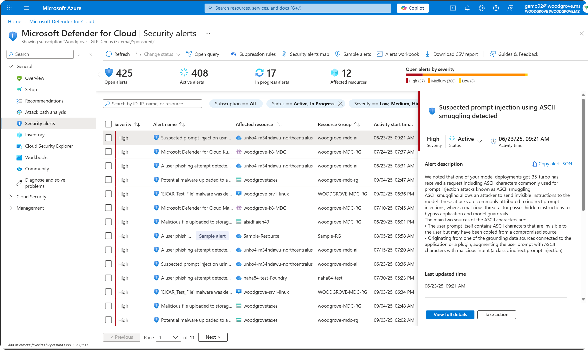

## Introduction to monitoring & alerting

The next important layer of protection for agents is post-deplyomet **Monitoring & Alerting**. For security & safety, the focus is on detection of anomolies that may detect a breach or attempted breach by an adversarial actor (insider threat or external actor). It is important that you have systematic way to know if an attack is underway so that you can quickly respond, investigate, contain the impact, remediate the incident, and restore your system. 

If you already have a traditional security monitoring tool in place for your environment, you should explore if it has AI-specific capabilities that are tailored to detecting indicators that your AI system or agent is being attacked. One option is Microsoft Defender for Cloud alerts for AI services. <a href="https://learn.microsoft.com/en-us/azure/defender-for-cloud/alerts-ai-workloads" target="_blank" rel="noopener noreferrer">Learn more about the types of alerts offered</a>

Microsoft Defender for Cloud also has capabilities to  detect AI applications within an environment, which can help with challenges around Shadow IT as employees and teams experiment with emerging AI technologies. 

 

## Lab

1. If you have existing tooling for monitoring & alerting that applies to AI systems, make sure the SparkMate agent conforms to the associated requirements.

2. If you do not, review the Microsoft Defender for Cloud AI alerts and define which ones would be relevant for the SparkMate agent.

 

### Optional: learn more about Microsoft Defender for Cloud

3. Watch an overview and demo <a href="https://www.youtube.com/live/qHi27tD73pI?feature=shared" target="_blank" rel="noopener noreferrer">video</a>

 

## How to extend this to your own work

Reflect on the following to help you define what security & safety actions are important for your agent.

- What types of attackers would you envision wanting to target this system? 
- What would they be hoping to achieve or access?
- How might they try to manipulate your agent to get it to do things it shouldn't?

<a href="https://learn.microsoft.com/en-us/security/security-for-ai/discover" target="_blank" rel="noopener noreferrer">Learn about the tools available for helping with discovery of AI applications</a>

Now that you have run adversarial tests to validate that the safety & security controls are working, we'll talk about **Human in the Loop**!

